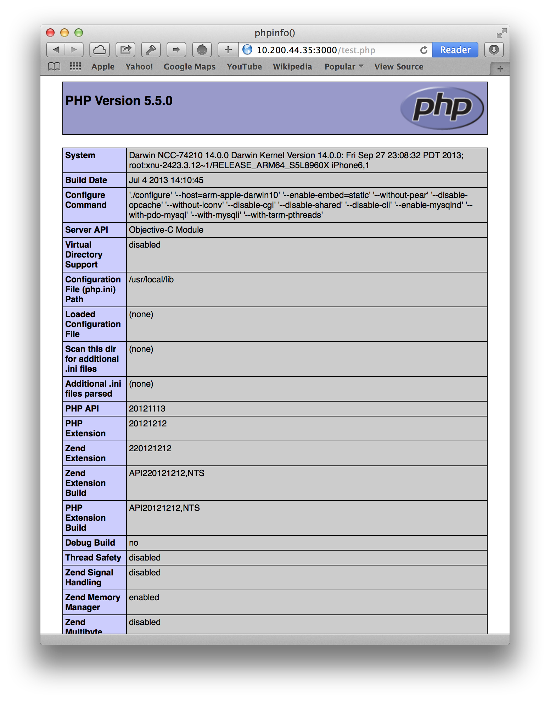

PHPTest
=======

PHPTest is a proof of concept for running PHP from a webserver that's embedded in an iOS application. The server runs on port 3000, and there's a script at `/test.php` that prints `phpinfo();`.

This was a fun little project to get working, however, I don't think I'll be doing any more development on it. If you want to continue messing around with it, check out the [`build-for-ios.sh`](https://github.com/grantjbutler/PHPTest/blob/master/php-5.5.0/build-for-ios.sh) script for how to compile a PHP static library that will run in your iOS app. This is optional as there's already a multi-architecture (meaning armv7, armv7s, and i386) library included in `PHPTest/`. However, if you do want to compile it yourself, remember to build multiple versions for each architecture (all the different variables are included in the bash script), as well as using `libtool` to merge them into one library so you don't have to juggle managing which library you're using for which target.

